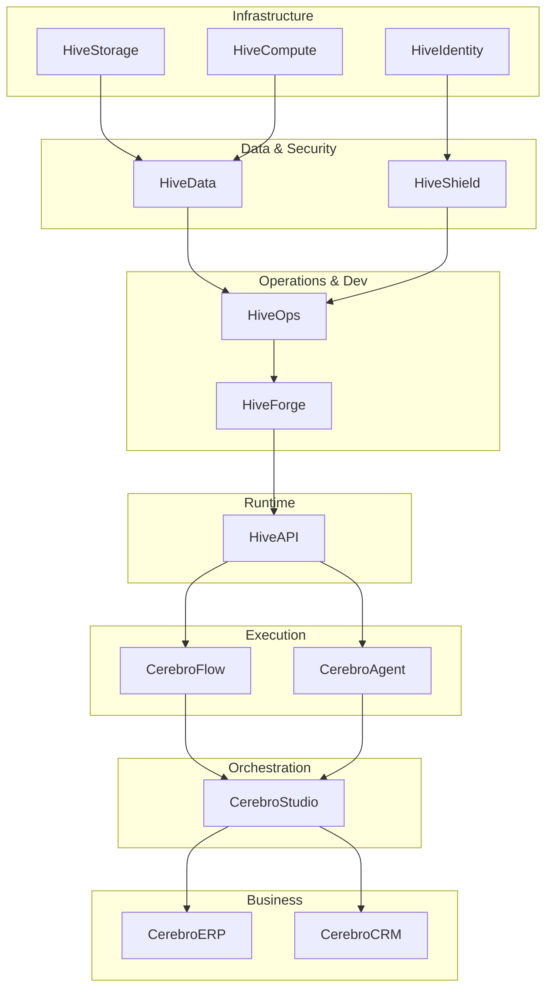

# CerebroHive™ Enterprise Capability Architecture

**Status:** Canonical Version 1.0  
**Governing Document:** `CEREBROHIVE_CONSTITUTION.md`  
**Upstream Dependency:** `PRODUCT_REGISTRY.md`

This document defines the architectural boundaries and capability mapping for the CerebroHive Intelligence Mesh. It ensures that every product serves a distinct capability, preventing feature overlap and defining clear integration paths.

---

## 1. Enterprise Capability Matrix

The Capability Matrix explicitly maps high-level business and technical capabilities to their governing products and underlying platform infrastructure. This guarantees modularity and single sources of truth for enterprise execution.

| Enterprise Capability | Governing Product (Cerebro) | Core Platform Service (Hive) |
| --------------------- | --------------------------- | ---------------------------- |
| **Automation**        | CerebroFlow™                | HiveForge™                   |
| **Autonomous Agents** | CerebroAgent™               | HiveOps™                     |
| **Search & RAG**      | CerebroSearch™              | HiveData™                    |
| **Data Analytics**    | CerebroInsight™             | HiveCompute™                 |
| **ERP & Finance**     | CerebroERP™                 | HiveAPI™                     |
| **CRM & Sales**       | CerebroCRM™                 | HiveAPI™                     |
| **Security & Trust**  | (Native to all)             | HiveShield™ & HiveIdentity™  |
| **Storage & Memory**  | CerebroArchive™             | HiveStorage™                 |
| **Marketplace**       | (Native to all)             | HiveExchange™                |

---

## 2. Product Family Architecture

Products are not developed in isolation. They belong to strict functional hierarchies that dictate how they integrate.

### Cerebro Applications Hierarchy
Business applications flow from raw intelligence to verticalized execution:
`Business Intelligence` (CerebroInsight, CerebroSearch)
  ↓
`AI Productivity` (CerebroStudio, CerebroAgent)
  ↓
`Enterprise Automation` (CerebroFlow)
  ↓
`Business Applications` (CerebroERP, CerebroCRM)
  ↓
`Industry Solutions` (Vertical-specific SKUs)

### Hive Platform Hierarchy
Platform capabilities flow from base infrastructure to developer extension:
`Infrastructure` (HiveCompute, HiveStorage, HiveNetwork)
  ↓
`Security` (HiveShield, HiveIdentity)
  ↓
`Operations & Data` (HiveOps, HiveData, HiveGovern)
  ↓
`Runtime & API` (HiveAPI, HiveConsole)
  ↓
`Developer Platform` (HiveForge)
  ↓
`Marketplace` (HiveExchange)

---

## 3. Platform Layering (The N-Tier OS Stack)

To maintain an Enterprise AI Operating System, the architecture is strictly layered. A higher layer can consume services from a lower layer, but lower layers cannot depend on higher layers.

1. **Presentation Layer (Tier 5)**
   - *CerebroStudio, External Customer Portals, Mobile Apps*
2. **Business Logic Layer (Tier 4)**
   - *CerebroFlow, CerebroAgent, CerebroERP*
3. **AI Intelligence & Orchestration Layer (Tier 3)**
   - *Reasoning Engines, Agent Planners, LLM Gateways*
4. **Platform Services Layer (Tier 2)**
   - *HiveAPI, HiveIdentity, HiveForge*
5. **Infrastructure & Data Layer (Tier 1)**
   - *HiveCompute, pgvector, Redis, Kafka Event Bus, S3 Storage*

---

## 4. Architectural Dependency Graph

Engineering prioritization and system integrations follow this strict dependency graph. If a node fails, downstream nodes gracefully degrade; upstream nodes remain unaffected.

---

## 5. Shared Platform Services

To eliminate duplication, all Cerebro products **must** consume the following shared Hive Platform services rather than building custom implementations:

* **Authentication & RBAC**: Must use `HiveIdentity`.
* **Database & Vector Storage**: Must use `HiveData` / `HiveStorage`.
* **API Gateways**: Must route through `HiveAPI`.
* **AI Model Invocation**: Must use the `HiveOps` LLM Gateway (no direct OpenAI/Anthropic SDK calls).
* **Audit Logging**: Must publish to the centralized `HiveGovern` event stream.
* **Agent Creation**: Must be orchestrated via `HiveForge`.

---

## 6. Execution Governance

By adhering to this Capability Architecture, CerebroHive ensures that:
1. When a new LLM is added to `HiveOps`, it is instantly available to `CerebroAgent` and `CerebroFlow`.
2. When a security policy is updated in `HiveShield`, it immediately protects `CerebroERP` and `CerebroCRM`.
3. When `HiveIdentity` scales, the entire Intelligence Mesh scales securely.
