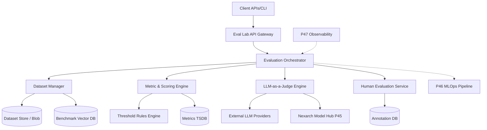

# Architecture

## Component Diagram

## Technology Stack Decisions
- **Backend Language**: Go (high concurrency for parallel evaluation pipelines) & Python (integration with ML evaluation frameworks like Ragas, TruLens).
- **Primary Database**: PostgreSQL for configuration, metadata, and evaluation run state.
- **Time-Series / Metrics DB**: TimescaleDB or ClickHouse for fast analytical queries over millions of evaluation results.
- **Message Broker**: NATS JetStream for distributing evaluation tasks to workers.
- **Storage**: S3-compatible blob storage for raw datasets and generated artifacts.

## Deployment Topology
- Distributed worker architecture: An API control plane manages the state, while scalable pool of Python-based worker pods executes the evaluations.
- Workers can be partitioned by task type (e.g., fast syntactic checks vs. heavy LLM-as-judge tasks).

## Scalability Approach
- Evaluation jobs are highly parallelizable; partitioned by dataset rows.
- Dynamic scaling of evaluation workers based on NATS queue depth.
- Caching of identical prompt-model evaluations to reduce API costs.

## Integration Points
- **P46 MLOps**: Triggers evaluation runs post-training; consumes pass/fail webhooks for model registry promotion.
- **P47 Observability**: Streams sample production traces for continuous shadow evaluation.
- **P45 Model Hub**: Sources candidate models to evaluate.
