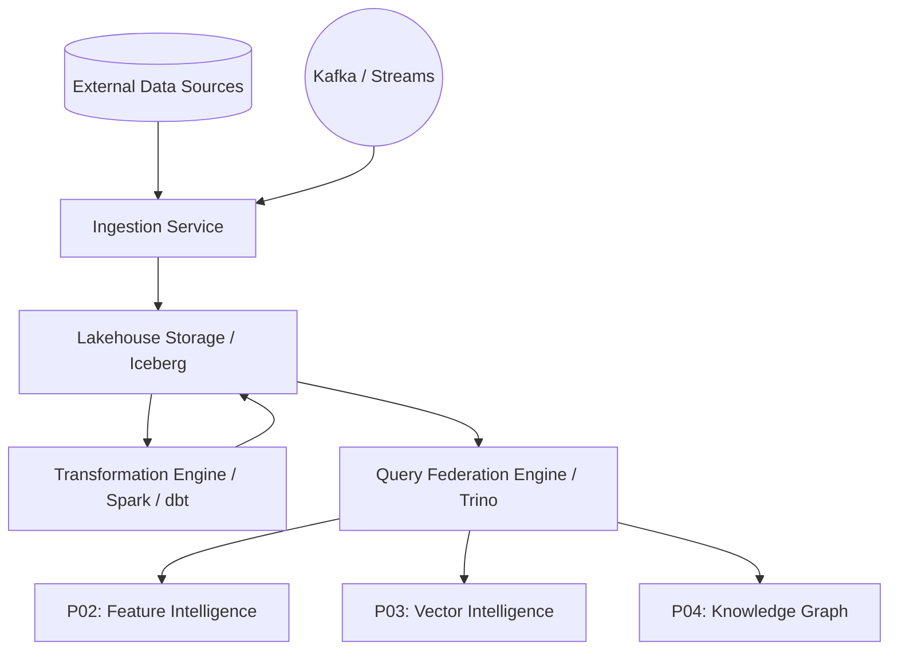

# Architecture: Nexarch Data Fabric

## Component Diagram

## Technology Stack Decisions
- **Storage Format:** Apache Iceberg - Allows ACID transactions, schema evolution, and time-travel on data lakes.
- **Query Federation:** Trino - Enables highly concurrent and scalable federated SQL queries across different data sources without data movement.
- **Transformation Engine:** Apache Spark & dbt core - Spark for heavy, distributed compute (ETL/ELT), dbt for SQL-based declarative transformations.
- **Streaming Engine:** Apache Flink - High-throughput, low-latency stream processing.
- **Orchestration:** Integrated with standard Nexarch job schedulers.

## Deployment Topology
- Kubernetes-native deployment (StatefulSets for storage nodes, Deployments for stateless services).
- Multi-AZ deployment for high availability.
- Separated compute and storage layers for independent scaling.

## Scalability Approach
- **Compute:** Auto-scaling worker groups for Spark and Trino based on query load and CPU/Memory utilization.
- **Storage:** Cloud-native object storage (S3-compatible) which is essentially infinitely scalable.
- **Ingestion:** Horizontally scalable connector pods distributed via Kafka partitions.

## Integration Points
- **P46 MLOps:** Feeds sanitized, transformed data directly into ML feature stores and model training pipelines.
- **P47 Observability:** Emits detailed telemetry, pipeline metrics, and data quality alerts to the centralized observability plane.
