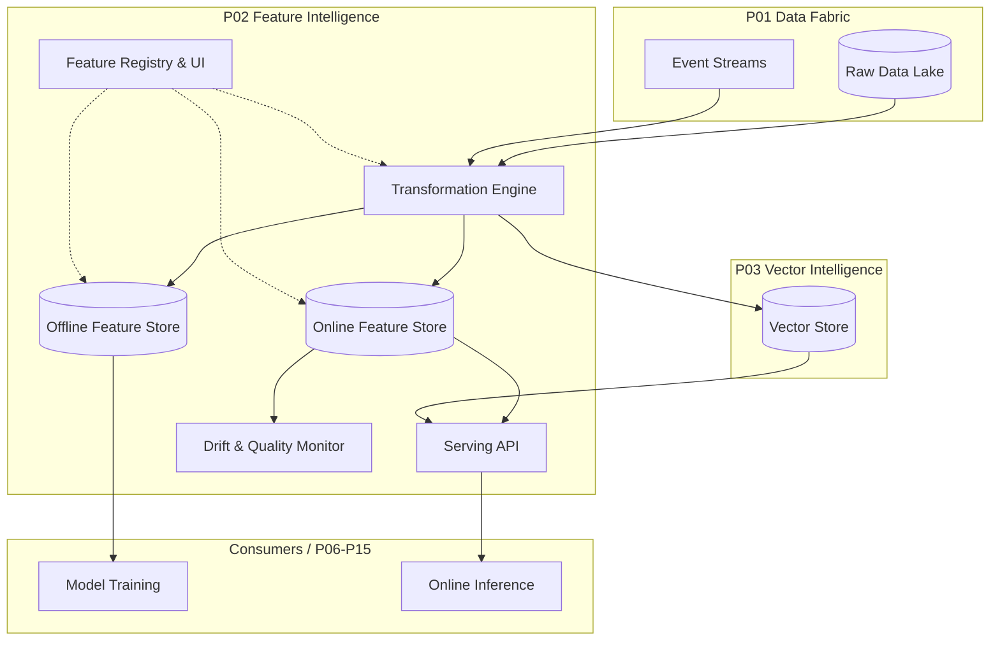

# Architecture: Nexarch Feature Intelligence (P02)

## Component Diagram

## Technology Stack Decisions
- **Compute Engine:** Apache Spark / Ray for scalable batch and stream feature transformations. Rationale: Proven ability to handle massive datasets and complex transformations.
- **Offline Store:** Apache Iceberg or Delta Lake on cloud object storage. Rationale: Supports time-travel queries essential for point-in-time correctness during training data generation.
- **Online Store:** Redis or Apache Cassandra. Rationale: Provides the necessary single-digit millisecond latency for real-time feature retrieval.
- **Serving API:** Go or Rust with gRPC and REST endpoints. Rationale: High concurrency, low memory footprint, and predictable latency.
- **Feature Registry:** PostgreSQL for relational metadata storage, exposed via GraphQL/REST API. Rationale: Strongly typed schemas and ACID properties for reliable metadata management.

## Deployment Topology
- **Control Plane:** Deployed as highly available Kubernetes stateless deployments (Registry API, monitoring services).
- **Data Plane (Offline):** Spark/Ray clusters provisioned on-demand or running continuously for streaming transformations.
- **Data Plane (Online):** Geographically distributed online stores (Redis/Cassandra) co-located with inference clusters to minimize network latency.

## Scalability Approach
- **Horizontal Scaling:** The Transformation Engine scales out horizontally by adding more worker nodes (Spark/Ray).
- **Read Replicas:** Online store uses read replicas and sharding based on entity IDs to handle high QPS.
- **Caching:** In-memory caching layers in the Serving API for extremely hot features.

## Integration Points
- **Consumes from P01 Data Fabric:** Reads raw batch data and consumes real-time event streams for feature calculation.
- **Integrates with P03 Vector Intelligence:** Offloads storage and retrieval of complex embedding types (dense, sparse, multi-vector) to P03, while retaining metadata and lineage in P02.
- **Provides to P06-P15 Learning Engines:** Exposes APIs for training dataset generation (offline) and real-time feature vectors (online).
