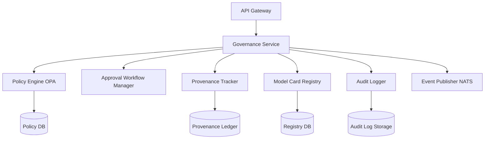

# Architecture

## Component Diagram

## Technology Stack Decisions
* **Service Framework:** NestJS / TypeScript - Aligning with Nexarch Enterprise AI OS standards for backend services.
* **Policy Engine:** Open Policy Agent (OPA) / Rego - Industry standard for policy-as-code, providing flexible and performant evaluations.
* **Database:** PostgreSQL via Prisma - Relational integrity for model cards, workflows, and policy metadata.
* **Audit Storage:** Immutable blob storage (e.g., AWS S3 with Object Lock / Azure Blob Storage immutable policies) for tamper-evident logging.
* **Event Streaming:** NATS JetStream - For high-throughput, low-latency, and persistent event publishing to other Nexarch products.

## Deployment Topology
Deployed as a scalable set of microservices within the Nexarch Kubernetes clusters. The Policy Engine (OPA) runs as a sidecar or tightly coupled daemonset to minimize latency during critical path evaluations. The Model Card Registry and Approval Workflow Manager scale independently based on load.

## Scalability Approach
* **Stateless Services:** Core governance services are stateless, scaling horizontally via Kubernetes HPA.
* **Policy Caching:** Compiled Rego policies are aggressively cached locally near the evaluation points.
* **Asynchronous Audit Logging:** Audit logs are written asynchronously to prevent blocking the critical path of model or agent execution.

## Integration Points
* **P44 Privacy Intelligence:** For continuous compliance and privacy assessments.
* **P47 Model Observability:** Consumes governance events for real-time monitoring.
* **Nexarch Agent Runtime (P02/P03/P04):** Queries the Governance API for agent action approvals and policy checks.
