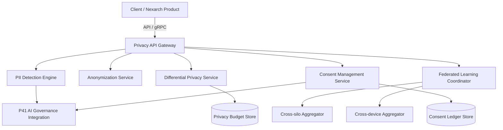

# Architecture: Nexarch Privacy Intelligence

## Component Diagram

## Technology Stack Decisions
- **TypeScript / Node.js**: Used for the API Gateway, Consent Management, and Anonymization orchestration. Rationale: Seamless integration with existing Nexarch enterprise microservices.
- **Python / PySyft / TensorFlow Privacy**: Used for the Differential Privacy and Federated Learning engines. Rationale: Industry-standard libraries for privacy-preserving machine learning.
- **Prisma & PostgreSQL**: Relational modeling for the Consent Ledger and Privacy Budget Store. Rationale: Strong ACID guarantees necessary for compliance records.
- **NATS / JetStream**: Event streaming for PII detection alerts and FL round orchestrations. Rationale: Low latency and high throughput for horizontal scalability.

## Deployment Topology
Deployed as a set of stateless Kubernetes deployments. The Python-based ML components (PII Detection, FL Aggregation) run on GPU-accelerated nodes, while the Node.js API layer runs on general-purpose compute. 
- Multi-AZ redundancy within regional clusters.
- Strict network isolation: All inbound traffic must pass through the internal Nexarch service mesh.

## Scalability Approach
- **PII Engine**: Horizontally autoscales based on CPU/GPU utilization and message queue depth.
- **FL Coordinator**: Uses hierarchical aggregation nodes to distribute secure aggregation load across multiple clusters.
- **Caching**: Redis is used to cache privacy budget consumption to reduce load on the PostgreSQL store.

## Integration Points
- **P41 AI Governance**: Bi-directional event flow for compliance checks and audit logging.
- **NEXARCH Data Ingestion**: Real-time anonymization hooks in the ingestion pipeline.
