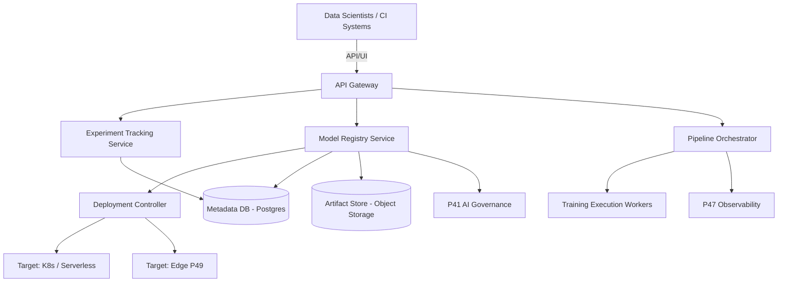

# Architecture

## Component Diagram

## Technology Stack Decisions
- **Backend**: Go & gRPC for high performance, concurrent pipeline execution, and robust API contracts.
- **Database**: PostgreSQL (Prisma ORM) for relational metadata, tracking entities, and pipeline state.
- **Artifact Store**: S3-compatible Object Storage for model weights and large serialized objects.
- **Pipeline DSL**: YAML-based DAGs compiled to Argo Workflows (Kubernetes native execution).
- **Experiment Tracking**: MLflow-compatible REST APIs to ensure seamless transition for existing Data Science workflows.

## Deployment Topology
- Distributed microservices deployed on Kubernetes.
- Stateless API servers and scalable worker nodes for pipeline execution.
- High-availability cluster for the metadata database.

## Scalability Approach
- Horizontal Pod Autoscaling (HPA) for API tier and execution workers.
- Sharding logic applied to experiment tracking records for high write throughput.
- Event-driven architecture leveraging NATS to decouple pipeline triggers from API responses.

## Integration Points
- **P47 Model Observability**: Listens to drift alerts to trigger Continuous Training (CT) pipelines.
- **P41 AI Governance**: Enforces approval checks before models can be transitioned to "Production" state.
- **P49 Edge Management**: Coordinates pushing optimized models to edge devices.
