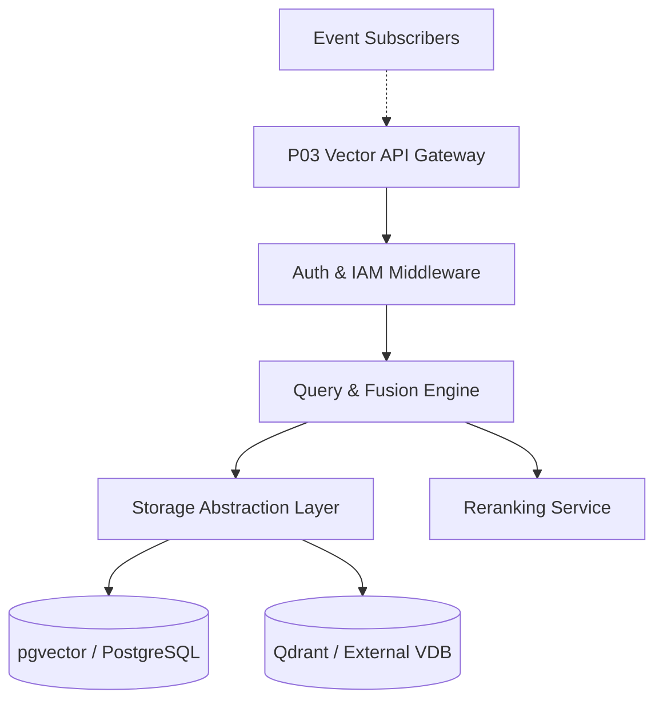

# Architecture: Nexarch Vector Intelligence

## Component Diagram

## Technology Stack & Decisions
- **API Framework:** Node.js (NestJS) / gRPC for internal low-latency microservice communication.
- **Vector Database Engine:** 
  - *Primary/Default:* We leverage the existing **pgvector** extension in the monorepo for small-to-medium enterprise tenants, maximizing operational simplicity and transactional guarantees with metadata.
  - *Scale-Out:* We introduce an abstraction layer supporting **Qdrant** for high-scale (>100M vectors) tenants requiring distributed HNSW and high-throughput ingestion.
- **Search Algorithms Supported:** HNSW (for fast ANN), IVF-Flat (for large clustered datasets), and Exact/Flat (for small, exact-match scenarios).
- **Hybrid Search Fusion:** Reciprocal Rank Fusion (RRF) implemented in the Query Engine, blending pgvector (dense) and PostgreSQL full-text search (sparse/BM25).

## Deployment Topology
Deployed as a stateless microservice within the Nexarch Kubernetes cluster. Scaled horizontally via HPA based on CPU and request queue depth. Vector databases (pgvector/Qdrant) are deployed as stateful sets with read-replicas for high-read-throughput query offloading.

## Scalability Approach
- **Read Scalability:** Read queries are distributed across database read-replicas.
- **Data Partitioning:** Vector tables/collections are partitioned by `tenant_id` to ensure isolated index builds and faster scoped searches.
- **Caching:** Frequently queried semantic embeddings (e.g., common enterprise knowledge) are cached at the edge using Redis.

## Integration Points
- **P02 (Feature/Embedding):** P02 generates embeddings and writes them to P03 via the Ingestion API.
- **P04 (Knowledge Graph):** KG nodes synchronize their vector representations to P03, linking `node_id` in P04 to `vector_id` in P03.
- **P28 (RAG Engine):** Calls P03's Hybrid Search API and Reranking interface to fetch context for LLM generation.
